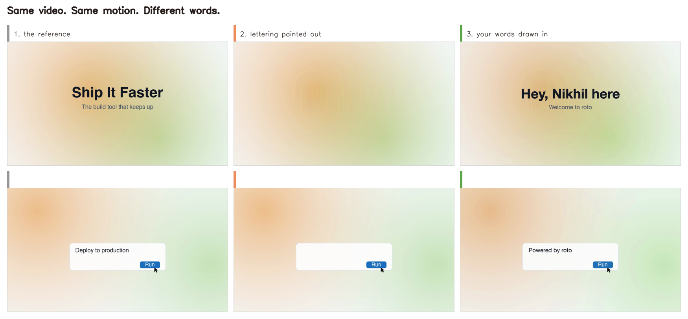
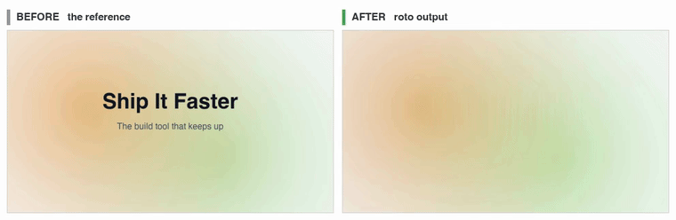

# roto

**You have a video. You want the same video, with your words in it.**

That's what this does.



Left is the original. Middle is that same frame with the lettering painted out and nothing else
touched. Right is the finished result. The gradient, the panel, the button and the cursor are
identical in all three. Only the words changed.

And the same thing in motion, which is the part a still cannot show:



Watch the gradient, the panel sliding in, and the cursor reaching the button. All of that is the
original's, untouched. Only the words are new.

Full quality, with sound: [before](docs/demo-before.mp4) and [after](docs/demo-after.mp4). The
soundtrack is carried straight through, copied packet for packet rather than re-encoded, and the
render verifies it came out identical to what went in.

The whole demo is reproducible from this repo: `docs/make-demo-reference.py` generates the reference
clip, `docs/demo-regions.json` says what to paint out and what to track, and `docs/demo-film.js` is
the twelve lines of text that became the new words. Nothing here is derived from anyone else's
footage, so it can all be published.

## The problem

Someone made a great 15-second product video. Text slides in, the background shifts, a cursor
travels across and clicks a button, little spinners turn into checkmarks. It looks expensive.

You want that video. Saying your thing, not theirs.

Today you have two bad options:

- **Rebuild the animation from scratch.** Days of work, and it comes out worse than the original.
- **Slap a box over their text and put yours on top.** Looks like a ransom note.

## What roto does

It erases their words out of the video and writes yours into the hole.

Frame by frame - all 360 of them - it paints out the original text and leaves *everything else*
exactly as it was. The moving gradient. The camera drift. The cursor. The button click. The
spinners. Then it draws your text back in, moving the way theirs moved.

You get their video, with your words.

## A real example

The example in this repo is a 15-second video whose title read **"Ai - powered"**, with a search box
that typed **"Compare Rive"**.

Run roto on it and you get the same video - same gradients, same zoom, same cursor travelling to the
same button, same spinners resolving in the same order - except the title now reads **"Change the
words"** and the box types **"Measured, not guessed"**.

Not a copy with a sticker over it. The words are genuinely gone and genuinely replaced.

## What you give it, what you get

**You give it:** a video file, and your words.

**You get:** an MP4, plus an editable project. Change your mind about the headline, change one line
of text, re-render in 30 seconds.

## How it works

Five steps. It does all of them.

1. **Chop up the video** into individual frames, and notice if it loops. (Most short videos secretly
   play the same 7 seconds twice - so it only has to do half the work.)
2. **Paint out the words** on every frame, leaving everything else untouched. These cleaned frames
   are called *plates*.
3. **Measure what moves.** If a panel slides 4px left and grows 2% between frames, it writes that
   down - so your text can ride along instead of sliding against it.
4. **Draw your text** onto the cleaned frames, positioned correctly on all 360.
5. **Render and check it.** Back into an MP4, with hash checks that nothing drifted.

## The catch

**You inherit the reference's timing exactly, and you cannot change it.**

The pacing, the camera moves, the layout - all frozen. You can only re-author what you erase. If you
want different timing or a different layout, this is the wrong tool and you should build something
original instead.

Also: it needs backgrounds it can convincingly paint over. Text on a smooth gradient, a flat panel,
a card - fine. Text over busy photographic detail - not fine.

## Rights, plainly

The output contains the original's actual pixels in every frame. It is a derivative work, and that
is visible.

So the skill asks who made the reference and what permission you have **before it touches a single
frame**, and stops if there isn't an answer. Downloading a video is not permission. A public tweet
is not permission. Music is a separate question from the visuals, and almost never travels with them.

It ships a picker of free and properly licensed music, and enforces the credit where the licence
demands one.

## Install

```sh
git clone https://github.com/nkapila6/roto ~/.claude/skills/roto
```

Then in Claude Code, just say what you want: *"here's an MP4, put our headlines in it."*

Requires Node 22+, FFmpeg, Chrome, `uv`, and the HyperFrames CLI.

## Where this fits with HyperFrames

HyperFrames turns HTML into video. Its existing workflows either **invent** the motion from your
description, or **leave footage alone** and put captions over it.

roto is a third thing: it **takes footage apart and rebuilds it**. The reference isn't a backdrop and
isn't left alone - it becomes the animation engine, and your text is the only part that's authored.

This works because HyperFrames *seeks* rather than plays: it asks for the frame at a given time, in
any order, so every frame has to be computable from its number alone. That is exactly what lets a
composition say "frame 137 = plate 137, plus this text at these measured coordinates."

## What's in it

| File | Does |
| --- | --- |
| `SKILL.md` | The workflow Claude follows |
| `scripts/analyze_reference.py` | Finds the loop, proposes the scene cuts, makes a contact sheet |
| `scripts/build_plates.py` | Paints out the text, measures the motion, audits for missed frames |
| `scripts/soundtrack.mjs` | Music picker: free/licensed sources, 5 fetchable tracks, credit enforcement |
| `scripts/hashes.mjs` | Pins every asset so you can prove nothing changed |
| `scripts/render.mjs` | Renders, encodes, verifies |
| `references/*.md` | Six docs on the parts that are actually hard |
| `templates/` | Starting configs and a working composition |

You describe your video in a JSON file. The image-processing maths is already written.

## Where it came from

Extracted from [Tejashmakwana/astra-chatgpt-hyperframes](https://github.com/Tejashmakwana/astra-chatgpt-hyperframes),
which uses this technique to make **one specific video**. Its coordinates are written into its
Python, so changing the video means rewriting the program.

roto turns that into something you point at any video: same technique, but the numbers are input
rather than source code. It also adds the loop/scene analyzer, a check for frames nobody cleared, the
music licensing tool, the font policy, and the docs.

**It is not a fork.** No files were copied and no media vendored. The technique, and some structure
in the image maths and the draw loop, are derived - hence the credit below.

### Verified against it

Built with the example config, roto reproduces astra's output exactly:

- finds its 180-frame loop, and 6 of its 7 hand-written scene boundaries with no false positives
- all six motion trackers match its committed values
- all 180 plates come out **pixel-identical** to its committed plates
- the render verifier reproduces both hashes in its published report

Three things roto fixes that are still live upstream:

- **About a second of the original designer's own typography ships in its finished video.** Two
  stretches are neither cleared nor drawn over, so the source lettering renders through. It's
  invisible in review, because uncleared lettering just looks like finished design. roto's coverage
  audit catches exactly this.
- **Two of the four H.264 colour tags never make it into the file** - they don't survive libx264, so
  they read back as `unknown` and players are left guessing.
- **Rebuilding one scene's plates silently blanked the other scenes' motion data.** Found and fixed
  here; the same shape of bug is latent in any per-scene rebuild.

## Credits and licence

Technique and some code structure derived from
[Tejashmakwana/astra-chatgpt-hyperframes](https://github.com/Tejashmakwana/astra-chatgpt-hyperframes),
MIT for its original project code. That repo's reference media is not covered by its MIT grant and is
not included here.

The original motion design behind it is by [Rajmoni (@Nexaabyraj)](https://x.com/Nexaabyraj). None of
that artwork ships here; it's named as the worked example the workflow came from.

Fetchable music is hosted on Wikimedia Commons under the licences named in `scripts/soundtrack.mjs`,
downloaded on demand rather than redistributed. *Odyssey* and *Lucid Coma* are CC BY and require
credit in anything you publish.

The demo clips are scored with *126 cha cha loop* by Bauchamp, CC0, fetched with
`scripts/soundtrack.mjs fetch cha-cha-loop`. CC0 asks for no credit; it is named here anyway.

HyperFrames is Apache-2.0, installed via npm.
